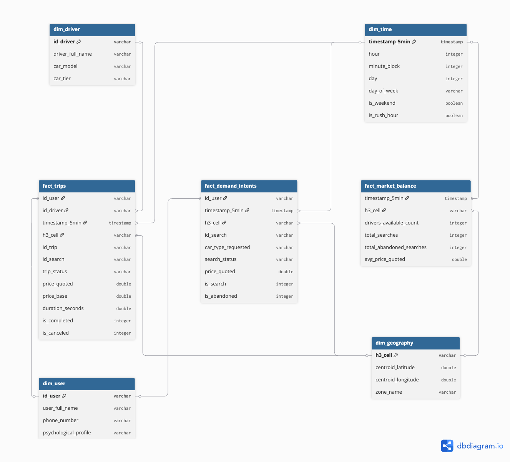

# Stochastic Mobility Demand & Marketplace Optimization (CDMX)

An enterprise-grade, high-performance Analytical Data Warehouse (OLAP) and econometrics pipeline designed to model stochastic demand behavior, geospatial fleet supply imbalances, and dynamic pricing elasticity within the Paseo de la Reforma corridor in Mexico City. 

The architecture processes **402+ Million high-frequency telemetry GPS records** using memory-optimized columnar streaming architectures.

---

## Data Warehouse Architecture (Conformed Constellation)

The analytics engine is structured around a **Kimball Conformed Constellation (Galaxy Schema)**. It decouples individual transactional flows into independent business processes linked through universal temporal and Uber H3 geospatial keys, completely eliminating data duplication and write-lock bottlenecks.

### Star Schema Components

#### Central Fact Tables (Isolated Business Processes)
1. **`fact_trips` (Operational Conversions Layer):** Tracks the lifecycle of ride requests, evaluating duration, cancellation rates, and physical conversion efficiency (4.3M records).
2. **`fact_demand_intents` (Gross & Latent Demand Layer):** Captures 100% of user search interactions, logging pricing dynamic quotes and session abandonment tokens to mitigate **Latent Demand Blindness** (5.3M records).
3. **`fact_market_balance` (Macro ML Analytics Matrix):** A high-speed space-time cross-join aggregating supply density (`drivers_available_count`) and price thresholds across 5-minute blocks and Uber H3 grids.

#### Conformed Dimensions (Universal Master Catalogs)
* **`dim_time`:** Chronological master matrix bucketed into discrete 5-minute interval blocks with rush-hour and weekend analytical flags.
* **`dim_geography`:** Spatial master maps translating high-resolution Uber H3 Resolution 9 global hexagons into geographical centroids (Latitude/Longitude) for localized corridor analytics.
* **`dim_user` & `dim_driver`:** Descriptive master catalogs mapping customer psychological profiles and operator vehicular tiers to preserve referential consistency across facts.

---

## Technology Stack & Optimization Strategy
* **Core Analytical Engine:** DuckDB (In-Memory Columnar Database)
* **Spatial Indexing Framework:** Uber H3 Hierarchy (Resolution 9 Grid)
* **Data Transport Architecture:** Zero-Disk Virtual Memory Views (`CREATE OR REPLACE VIEW`)
* **Physical Storage Format:** Apache Parquet (Snappy Compressed Columnar Layout)
